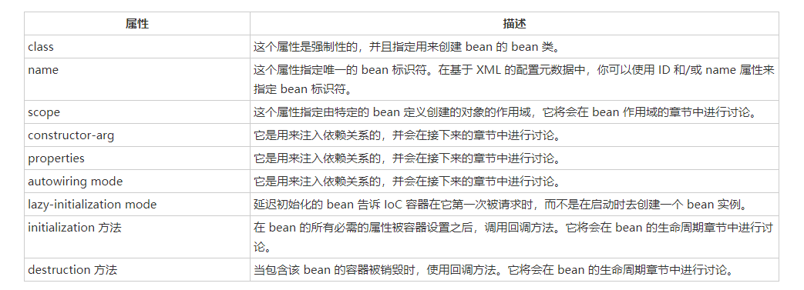

# 1. spring
https://www.w3cschool.cn/wkspring/tydj1ick.html
## 1.1 Spring IoC 容器


简介： Spring 容器是 Spring 框架的核心。容器将创建对象，把它们连接在一起，配置它们，并管理他们的整个生命周期

从创建到销毁。Spring 容器使用依赖注入（DI）来管理组成一个应用程序的组件。这些对象被称为 Spring Beans 

 IOC 容器:具有依赖注入功能的容器，它可以创建对象，IOC 容器负责实例化、定位、配置应用程序中的对象及建立这些对象间的依赖。通常new一个实例，控制权由程序员控制，而"控制反转"是指new实例工作不由程序员来做而是交给Spring容器来做 

### 1.1.1 Spring BeanFactory 容器

```java
package com.tutorialspoint;
public class HelloWorld {
   private String message;
   public void setMessage(String message){
    this.message  = message;
   }
   public void getMessage(){
    System.out.println("Your Message : " + message);
   }
}
package com.tutorialspoint;
import org.springframework.beans.factory.InitializingBean;
import org.springframework.beans.factory.xml.XmlBeanFactory;
import org.springframework.core.io.ClassPathResource;
public class MainApp {
   public static void main(String[] args) {
      XmlBeanFactory factory = new XmlBeanFactory
                             (new ClassPathResource("Beans.xml"));
      HelloWorld obj = (HelloWorld) factory.getBean("helloWorld");
      obj.getMessage();
   }
}
```

   

```xml
<?xml version="1.0" encoding="UTF-8"?>
<beans xmlns="http://www.springframework.org/schema/beans"
    xmlns:xsi="http://www.w3.org/2001/XMLSchema-instance"
    xsi:schemaLocation="http://www.springframework.org/schema/beans
    http://www.springframework.org/schema/beans/spring-beans-3.0.xsd">

   <bean id="helloWorld" class="com.tutorialspoint.HelloWorld">
       <property name="message" value="Hello World!"/>
   </bean>

</beans>
```

### 1.1.2 Spring ApplicationContext 容器

```java
package com.tutorialspoint;
import org.springframework.context.ApplicationContext;
import org.springframework.context.support.FileSystemXmlApplicationContext;
public class MainApp {
   public static void main(String[] args) {
      ApplicationContext context = new FileSystemXmlApplicationContext
            ("C:/Users/ZARA/workspace/HelloSpring/src/Beans.xml");
      HelloWorld obj = (HelloWorld) context.getBean("helloWorld");
      obj.getMessage();
   }
}
```

### 1.1.3 Spring Bean 定义

**Bean定义**



## 2.1Spring 框架的 AOP

Spring 框架的一个关键组件是**面向方面的编程**(AOP)框架。面向方面的编程需要把程序逻辑分解成不同的部分称为所谓的关注点。跨一个应用程序的多个点的功能被称为**横切关注点**，这些横切关注点在概念上独立于应用程序的业务逻辑。有各种各样的常见的很好的方面的例子，如日志记录、审计、声明式事务、安全性和缓存等。


